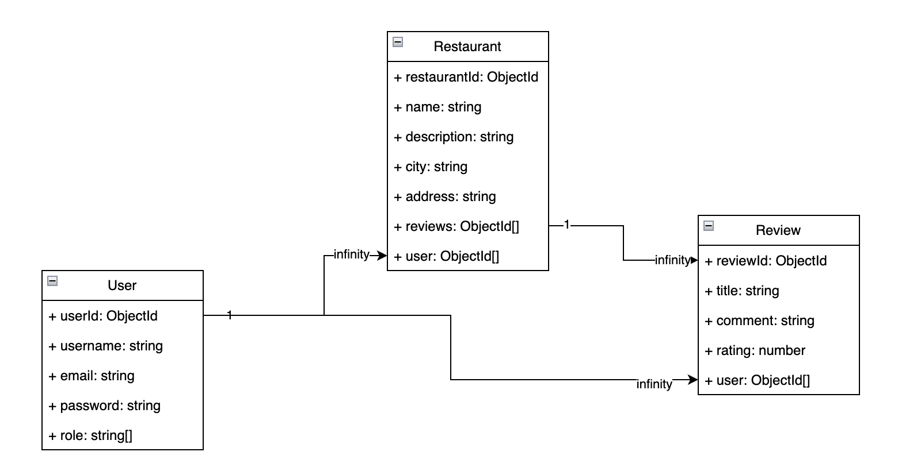

# Restaurant Web Application

## Overview

This fullstack web application was developed to enhance my skills in modern web development, using a range of popular frameworks and technologies. The application is a restaurant website that allows users to browse restaurants created by other users, as well as create, edit, and delete their own restaurants. Additionally, users can manage reviews for each restaurant, including creating, updating, and deleting reviews. Authentication and authorization are handled through JWT, ensuring secure access to user-specific features.

## Features

- **User Authentication**: Registration, login, and logout functionality using JWT authentication.
- **Restaurant and Review Management**: Users can create, edit, and delete their own restaurants and reviews.
- **Responsive Frontend**: Developed using Material-UI (MUI) for a sleek and responsive user interface.
- **Robust Backend**: A well-structured backend developed using NestJS, supporting scalable and maintainable code.

## Technology Stack

- **Frontend**: React, Material-UI (MUI), TanStack React Query
- **Backend**: NestJS (Node.js, TypeScript), MongoDB
- **Testing**: Jest (for both frontend and backend unit tests)
- **Authentication**: JWT (JSON Web Token)

## How to Run Locally

### Prerequisites

Ensure you have the following installed:

- Node.js
- npm (or yarn)
- MongoDB

### Setting Up Environment Variables

1. Clone the repository.
2. Navigate to both the `store-site-api` and `store-site-app` directories.
3. Copy the `.env.sample` files to `.env` and fill in the required environment variables.

### Running the Backend (API)

1. Navigate to the `store-site-api` directory.
2. Ensure MongoDB is running on your machine.
3. Install dependencies: `npm install`
4. Start the API: `npm run start`

### Running the Frontend

1. Navigate to the `store-site-app` directory.
2. Install dependencies: `npm install`
3. Start the application: `npm run start`
4. Ensure the frontend is properly connected to the API by checking the network calls in the browser.

### Additional Notes for Different Terminals

If you’re using `zshrc` or another shell, you may need to set the environment variables differently. Please refer to the relevant terminal documentation for guidance on setting environment variables. For example, with zsh, you may need to set your zshrc file with the correct environment variables and their respective values

## Backend Architecture

The backend is designed around three primary models with one-to-many relationships:

- **User** to **Restaurants**: A user can create multiple restaurants.
- **User** to **Reviews**: A user can write multiple reviews.
- **Restaurants** to **Reviews**: Each restaurant can have multiple reviews associated with it.

## Demo

**PLACEHOLDER: Create and link to a demo video that showcases the functionality of the application.**

## Project Next Steps

- **Fixing Frontend Bugs**: Addressing any UI quirks and enhancing user experience.
- **Deployment**: Deploying the application to Heroku or another cloud service.
- **Dockerization**: Creating a Docker file to facilitate local development and testing.
- **Feature Expansion**: Adding new features and improving existing ones based on user feedback.
- **E2E Testing**: Implementing end-to-end testing using Cypress to ensure the application functions as expected in real-world scenarios.
